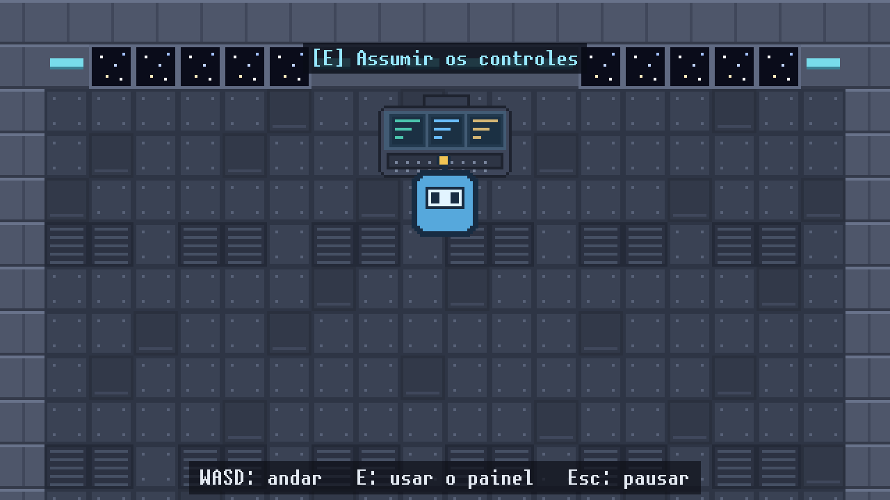
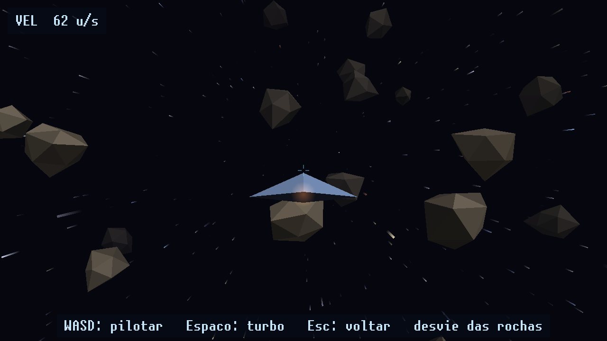

# Jogo SDL3

Você anda pelo interior de uma nave em 2D, usa o painel de pilotagem do convés e
a tela vira um voo 3D: um caça low poly atravessando um campo de estrelas gerado
proceduralmente.





## Dependências e build

SDL 3.4 ou mais recente, CMake 3.28+ e um compilador C++20.

```sh
sudo pacman -S sdl3 cmake ninja     # Arch; em outras distros, o pacote de dev do SDL3
cmake --preset debug
cmake --build build/debug
./build/debug/jogo
```

Não há dependência de `SDL3_image`, `SDL3_ttf` ou `SDL3_mixer`: o SDL 3.4 já traz
PNG e WAV no core (`SDL_LoadPNG`, `SDL_LoadWAV`), o texto usa uma fonte bitmap e
o áudio mixa vozes com `SDL_AudioStream`.

Há também o preset `release`. Os assets são copiados para junto do executável a
cada build, então o jogo roda de qualquer diretório; eles já vêm gerados em
`assets/`, e `tools/gen_assets.py` (Pillow) os regenera.

## Controles

| Ação | Teclado | Gamepad |
|---|---|---|
| Andar / pilotar / navegar | WASD ou setas | analógico esquerdo / direcional |
| **Usar o painel** (interior) | **E** | X (botão oeste) |
| Turbo (voo 3D) | Espaço | A (botão sul) |
| Confirmar (menu) | Enter ou Espaço | A (botão sul) |
| Voltar ao console / sair | Esc | B / Back |
| Pausar | Esc ou P | Start |
| Tela cheia | F11 | — |
| Menu (na pausa) | M | — |

## O 3D sem shaders

`Renderer3D` é um rasterizador por software que termina em uma única chamada de
`SDL_RenderGeometry` por quadro — nada de SDL_gpu, OpenGL ou SPIR-V:

1. cada face vira três vértices em espaço de mundo (`posição + rotação * vértice`);
2. descarte de faces traseiras pela normal contra a direção do olhar;
3. sombreamento *flat*: uma luz direcional fixa modula a cor da face;
4. recorte no plano próximo (Sutherland–Hodgman em um plano só), que pode
   transformar o triângulo em um quadrilátero — daí o leque de triângulos;
5. projeção em perspectiva com distância focal derivada do fov;
6. **algoritmo do pintor**: sem z-buffer, as faces são ordenadas de trás para
   frente antes de emitir a geometria.

O campo de estrelas (`Starfield`) sorteia posições com um xorshift semeado dentro
de um cubo e, a cada quadro, reposiciona cada estrela por *wrap* em torno da
câmera: um campo infinito com memória constante. O rastro sai de projetar a
estrela deslocada de `velocidade * Δt` e desenhar um quadrilátero que desvanece
na cauda, em blending aditivo.

## Como o laço funciona

`App::rodar()` mede o tempo real do quadro, acumula e simula em fatias fixas de
1/60 s (`StepTimer::kPassoFixo`), com teto de 0,25 s por quadro para evitar
avalanche de updates depois de um travamento. O que sobra no acumulador vira o
`alpha` passado ao desenho, usado para interpolar posição e orientação. Assim a
física é determinística e o desenho é suave em qualquer taxa de quadros.

Tudo é desenhado em coordenadas lógicas de **640×360**
(`SDL_SetRenderLogicalPresentation` com letterbox); o SDL escala para o tamanho
real da janela e converte as coordenadas do mouse.

## Arquitetura

Mapa do código, como adicionar uma cena e como adicionar assets:
[docs/ARQUITETURA.md](docs/ARQUITETURA.md).

## Licença

Código sob a licença MIT — veja [LICENSE](LICENSE).

**Exceção:** a fonte bitmap em `assets/fonts/` é derivada da Liberation Mono e
continua sob a SIL Open Font License 1.1. Os detalhes e o texto da licença estão
em [assets/fonts/README.md](assets/fonts/README.md).
